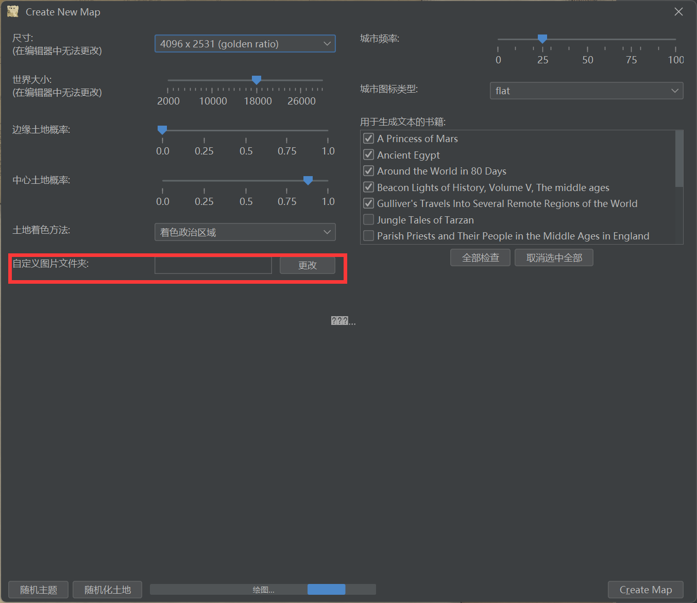

# nortantis
Nortantis 是一个奇幻地图生成器，最初作为一个学术项目创建。它使用简单的构造板块模拟来生成带有树木、河流和山脉的岛屿和大陆。生成的地图具有老式手绘地图的外观。

有关更多信息和生成的地图示例，请参见项目页面 [这里](http://jeheydorn.github.io/nortantis/)。

本项目从 [https://github.com/jeheydorn/nortantis](https://github.com/jeheydorn/nortantis) 翻译而来（英文翻译成中文）。

# 安装
在[页面](https://github.com/gjhhust/nortantis/releases)中下载最新版本的安装程序(.msi文件)。

# 使用
软件完整使用的视频介绍如下：

哔哩哔哩视频页面（https://www.bilibili.com/video/BV1tXDkYNETs/ ）。

# 个人添加素材（可选）：
1. 官方素材包无需设置，软件会自动使用官方素材。
2. 如果个人需要添加素材，需先下载官方素材包，接着补充自己的素材，在[页面](https://github.com/gjhhust/nortantis/releases)中下载最新版本的官方素材包(assets_vx.x.zip)。
3. 保持以下素材目录结构添加自己的素材：
```
├─books
├─borders（绘制地图的线条素材）
│  ├─dashes
│  ├─dashes with inset corners
│  └─lines
├─cities（城市）
│  ├─flat
│  └─middle ages
├─decorations（装饰）
│  ├─compasses
│  ├─other
│  └─ships
├─example textures
├─hills（丘陵）
│  ├─round
│  ├─sharp
│  └─spires
├─internal
├─mountains（山脉）
│  ├─round
│  ├─sharp
│  └─spires
├─sand（沙丘）
│  └─dunes
└─trees（树木）
    ├─cacti
    ├─deciduous
    ├─original deciduous
    ├─original pine
    └─pine
```
4. 添加完素材后，在软件中选择相应的素材目录：
   - **步骤一**：打开软件后，新建地图时选择：
   
   - **步骤二**：在弹出的设置窗口中，点击
   
   - **步骤三**：点击右侧的浏览按钮，选择您存放素材的文件夹，然后点击"OK"保存设置。
   

# 分享自己的素材（可选）
如果您想分享自己的素材，请提交素材的zip压缩包。压缩包内素材格式请保持和官方一致的风格。

**注意事项**：
1. 大类别（如books、borders、example textures等）无法更改，不能增删这些大类文件夹。
2. 大类下面的子文件夹可以自行增删修改。
3. 素材文件命名需满足“name1 width=150.png”的格式，其中width决定了素材放置上去的大小。

**分享方法**：
您可以通过GitHub提交您的素材：
1. 打开项目的GitHub仓库：[https://github.com/gjhhust/nortantis](https://github.com/gjhhust/nortantis)
2. 点击"Issues"选项卡
3. 点击"New issue"按钮
4. 在标题中注明"[素材分享]"，并在描述中简要介绍您的素材
5. 将您的素材压缩包上传到issue中
6. 点击"Submit new issue"提交

您可以通过邮箱提交：
1. 发送邮件至 gjh_hust@foxmail.com
2. 主题注明"[素材分享]"
3. 正文中简要介绍您的素材，并附上您的素材压缩包和你的名称（可以是网络昵称），后续发布我们发布声明

我们会定期审核并将合适的素材添加到官方素材库中。感谢您的贡献！

# 开发（可选）

## 在vscode上运行和开发该项目
1. 在 vscode 中安装 gradle
2. 在 vscode 中打开项目
3. 在 vscode 中打开终端
4. 在 gradle 任务中运行Task->applaction->run

## 打包安装程序
1. src\nortantis\util\AssetsPath.java 中将 public static boolean isInstalled = true;
2. 运行installer\create_windows_installer.bat即可打包成安装程序